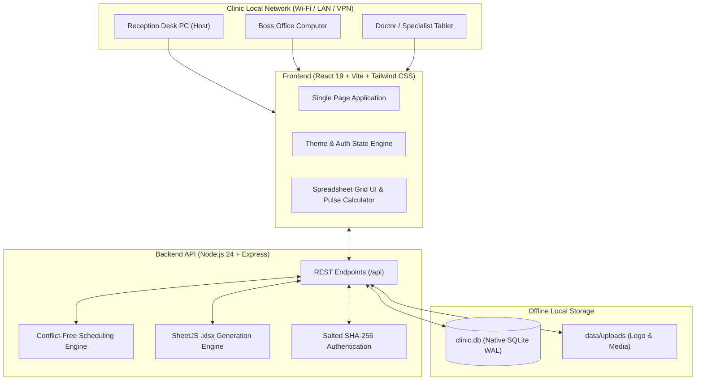

# MEDIKA — Local-First Clinic Reception & Client Spreadsheet System

[](https://react.dev/)
[](https://vitejs.dev/)
[](https://nodejs.org/)
[](https://sqlite.org/)
[](https://tailwindcss.com/)
[](LICENSE)

> A full-stack, local-first aesthetic & medical clinic reception management application. Designed for multi-device LAN/VPN synchronization, zero cloud fees, complete HIPAA/privacy compliance, collision-free appointment scheduling, and automated Excel spreadsheet synchronization for every client.

---

## 📸 Key Features & Capabilities

### 1. 📅 Conflict-Free Appointment Scheduling
* **Double-Booking Prevention Algorithm**: Enforces an overlap constraint ensuring no specialist or machine operator can be scheduled in two overlapping appointments simultaneously.
* **Respective Day Filter**: Automatically highlights today's appointments (e.g. October 4, 2026) with quick-filtering by date.
* **1-Click Waiting Room Check-In**: Transitions clients directly from the appointment schedule into the waiting room queue with automatic token assignment (`#1`, `#2`, `#3`).
* **Full CRUD Operations**: Instant modal editing for client names, date/time, packages, and assigned staff.

### 2. 📊 Client Spreadsheet & Automated Pulse Counter
* **Dedicated Spreadsheet for Every Client**: Tracks longitudinal session histories with exact clinical parameters:
  * `DATE` &bull; `MACHINE #` &bull; `PACKAGE` &bull; `SESSION #` &bull; `SKIN TYPE (Fitzpatrick 1-6)` &bull; `ENERGY (Joules)`
  * `START COUNT` &bull; `END COUNT` &bull; `EMPLOYEE / OPERATOR` &bull; `M/C STATUS` &bull; `RESULTS / REACTION`
* **Real-Time Pulse Calculation**: Automatically computes pulse counts (`End Count - Start Count`) as the operator types.
* **Pixel-Perfect Excel (`.xlsx`) Export**: Generates formatted workbooks mirroring physical clinic paper cards, complete with header metadata, column spacing, and formatted template rows.

### 3. 👥 Live Waiting Room & Reception Queue
* **Token Workflow**: Generates sequential daily tokens and tracks stage transitions (`Waiting` ⏱️ ➔ `In Room` 🩺 ➔ `Completed` ✅ ➔ `Cancelled` ❌).
* **Medical Notice & Allergy Warnings**: Highlights client skin sensitivities, allergies, or precautions directly on queue tokens.
* **Instant Search**: Real-time filtering across clients by name, token number, phone, or specialist.

### 4. 🌐 Multi-Computer & VPN Network Architecture
* **LAN / Wi-Fi Synchronization**: Runs locally on a single machine and serves all other devices on the clinic Wi-Fi or VPN (Boss PC, secondary reception desks, doctor tablets) at `http://<HOST_IP>:3000`.
* **Zero Cloud Latency & Privacy**: All patient phone numbers, clinical records, and financial numbers remain strictly local on the clinic's hardware.

### 5. 🔐 Role-Based Security & Access Control
* **Boss (Admin)**: Full access to appointment booking, queues, client spreadsheets, master audit logs, staff rosters, clinic settings, and database restoration.
* **Staff (Reception)**: Fast access to appointment check-in, waiting room queues, and client session logging.
* **Encrypted Credential Verification**: Salted SHA-256 password hashing with session-based tokens.

### 6. 💾 Local Database Recovery & 1-Click Backups
* **Embedded SQLite with WAL Mode**: High-concurrency, ACID-compliant local storage in `data/clinic.db`.
* **1-Click Database Restore**: Upload any saved `.db` backup file directly in the browser to recover records in seconds with automatic pre-restore safety rollbacks.

### 7. 🎨 Dynamic Theme Engine & Clinic Customization
* **6 Curated Medical Palettes**: Rose Beauty 🌸, Clinical Teal 🌊, Royal Blue 💎, Emerald 🌿, Lavender Violet 🔮, and Slate Gray 🌑.
* **Custom Logo Upload**: Upload clinic brand logos displayed in navigation headers and printable client cards.

---

## 🏛️ System Architecture



---

## 📁 Repository Structure

```
medika-clinic-app/
├── client/                     # Frontend React + Vite Application
│   ├── src/
│   │   ├── components/         # Modular UI Components
│   │   │   ├── AppointmentsView.jsx    # Conflict-checked calendar & 1-click check-in
│   │   │   ├── QueueView.jsx           # Live waiting room tokens & search
│   │   │   ├── PatientsView.jsx        # Client directory & profile editor
│   │   │   ├── PatientSheetModal.jsx   # Clinical spreadsheet & pulse counter
│   │   │   ├── MasterSpreadsheetView.jsx # Clinic-wide master audit table
│   │   │   ├── EditAppointmentModal.jsx # Appointment modifier
│   │   │   ├── StaffModal.jsx          # Doctor & specialist roster manager
│   │   │   ├── ClinicSettingsModal.jsx # Branding, theme color, logo upload
│   │   │   ├── BackupModal.jsx         # 1-click database download & restore
│   │   │   ├── LoginModal.jsx          # Role-based security gateway
│   │   │   └── Navbar.jsx              # Header with LAN IP & user role
│   │   ├── theme.js            # Dynamic color theme configuration
│   │   ├── App.jsx             # Root layout & routing
│   │   └── main.jsx
│   ├── vite.config.js          # Configured with host: 0.0.0.0 for LAN access
│   └── package.json
├── server/                     # Backend API & SQLite Database
│   ├── db.js                   # Schema definitions, migrations, WAL mode
│   └── index.js                # Express API, scheduling, auth, Excel generator
├── data/                       # Local offline storage (SQLite & uploads)
│   ├── clinic.db               # Embedded database file
│   └── uploads/                # Custom clinic logo storage
├── start-medika.bat            # 1-Click Windows desktop launcher
├── CLINIC_CUSTOMIZATION_GUIDE.md # User & admin operations guide
├── package.json                # Root automation scripts
└── README.md                   # Project documentation
```

---

## 🚀 Quickstart Guide

### Prerequisites
* **Node.js**: v20 or higher (v24 recommended)
* **npm**: v10 or higher
* **Google Chrome** or any modern browser

### 1. Clone the Repository
```bash
git clone https://github.com/YOUR_USERNAME/medika-clinic-app.git
cd medika-clinic-app
```

### 2. Install Dependencies
```bash
npm run install-all
```

### 3. Run the Development Servers
```bash
npm run dev
```

Open **`http://localhost:3000`** in Google Chrome.

### 4. Or Use the One-Click Windows Launcher
On Windows, simply double-click **`start-medika.bat`**. It will automatically start the backend, start the frontend, and open Google Chrome!

---

## 🔐 Default Security Credentials

| Username | Password | Role | Description |
|---|---|---|---|
| `boss` | `boss123` | **Boss (Admin)** | Full administrative access & database control |
| `reception` | `staff123` | **Staff** | Front reception check-in & client scheduling |

*(Credentials can be modified anytime in Settings ⚙️ ➔ Account Security).*

---

## 🛠️ Built With

* **Frontend**: React 19, Vite 8, Tailwind CSS v4, Lucide React Icons
* **Backend**: Node.js 24, Express, Multer, SheetJS (`xlsx`)
* **Database**: Embedded SQLite via Node's native `node:sqlite` (WAL Mode)
* **Networking**: Local Area Network binding (`0.0.0.0`) for multi-device clinic access

---

## 📄 License
This project is licensed under the MIT License — feel free to use it for your clinic or portfolio!
